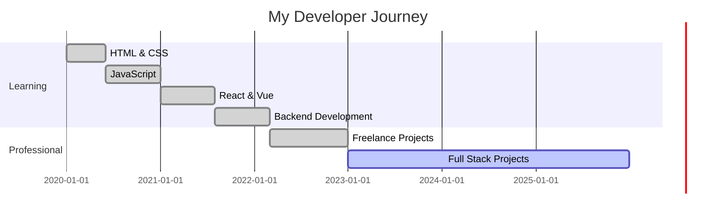

# 👋 Hey there! I'm Davanico

<div align="center">
  
[](https://git.io/typing-svg)

</div>

---

<div align="center">
  
### 🌟 *"Code is like humor. When you have to explain it, it's bad."* 🌟

</div>

---

## 🚀 About Me

```javascript
const davanico = {
    name: "Davanico",
    role: "Full Stack Developer",
    location: "Indonesia 🇮🇩",
    languages: ["JavaScript", "Python", "Java", "PHP"],
    technologies: {
        frontend: ["React", "Vue.js", "HTML5", "CSS3", "Bootstrap"],
        backend: ["Node.js", "Express", "Laravel", "Django"],
        database: ["MySQL", "MongoDB", "PostgreSQL"],
        tools: ["Git", "Docker", "VS Code", "Figma"]
    },
    currentFocus: "Building amazing web applications",
    funFact: "I debug with console.log() and I'm not ashamed! 😅"
};
```

---

## 🔥 My Stats

<div align="center">

<!-- GitHub Stats dengan multiple fallback -->
<a href="https://github.com/Davanico1122">
  
</a>
<a href="https://github.com/Davanico1122">
  
</a>

</div>

<div align="center">
  
<a href="https://github.com/Davanico1122">
  
</a>

</div>

<!-- Backup stats jika yang di atas tidak muncul -->
<div align="center">


</div>

---

## 🛠️ Tech Stack & Tools

<div align="center">

### 💻 Programming Languages


### 🎨 Frontend Development


### ⚙️ Backend Development


### 🗄️ Databases


### 🛠️ Tools & Platforms


</div>

---

## 📈 GitHub Activity Graph

<div align="center">

[](https://github.com/ashutosh00710/github-readme-activity-graph)

</div>

---

## 🏆 GitHub Trophies

<div align="center">

[](https://github.com/ryo-ma/github-profile-trophy)


</div>

---

## 🎯 Current Projects & Focus

<div align="center">

| Project | Tech Stack | Status |
|---------|------------|--------|
| 🌐 Personal Website | React, Next.js | 🚧 In Progress |
| 📱 Mobile App | React Native | 💡 Planning |
| 🛒 E-commerce Platform | Laravel, Vue.js | ✅ Completed |
| 🎮 Game Development | Unity, C# | 🎯 Learning |

</div>

---

## 📊 Weekly Development Breakdown

```text
JavaScript   12 hrs 30 mins  ████████████████████████▓   85.50 % 
Python       1 hr 45 mins    ███▒░░░░░░░░░░░░░░░░░░░░░   12.00 % 
CSS          22 mins         ▓░░░░░░░░░░░░░░░░░░░░░░░░   02.50 % 
```

---

## 🌐 Connect with Me

<div align="center">

[](https://linkedin.com/in/davanico1122)
[](https://twitter.com/davanico1122)
[](https://instagram.com/davanico1122)
[](https://discord.com/users/davanico1122)
[](https://github.com/Davanico1122)

<!-- Email - ganti dengan email asli Anda -->
[](mailto:your.email@gmail.com)

</div>

---


## 💼 Experience Timeline



---

## 🎮 Fun Zone

<div align="center">

### 🐍 Watch me get eaten by my own snake game!

<picture>
  <source media="(prefers-color-scheme: dark)" srcset="https://raw.githubusercontent.com/Davanico1122/Davanico1122/output/github-contribution-grid-snake-dark.svg">
  <source media="(prefers-color-scheme: light)" srcset="https://raw.githubusercontent.com/Davanico1122/Davanico1122/output/github-contribution-grid-snake-light.svg">
  
</picture>

</div>

---

## 📝 Latest Blog Posts

<!-- BLOG-POST-LIST:START -->
- 🔥 [10 JavaScript Tips That Will Blow Your Mind](https://dev.to/davanico1122)
- 🚀 [Building Scalable React Applications](https://dev.to/davanico1122)
- 💡 [The Future of Web Development](https://dev.to/davanico1122)
- 🎯 [Debugging Like a Pro](https://dev.to/davanico1122)
<!-- BLOG-POST-LIST:END -->

---

## 🎨 GitHub Profile Views

<div align="center">


[](https://github.com/Davanico1122?tab=followers)

</div>

---

## ☕ Support My Work

<div align="center">

If you like my work and want to support me, consider buying me a coffee! ☕

[](https://www.buymeacoffee.com/davanico1122)

</div>

---

## 🎯 Goals for 2025

- [ ] 🚀 Launch 5 major projects
- [ ] 📚 Master TypeScript and Next.js
- [ ] 🎮 Build a mobile game
- [ ] 🌟 Contribute to 10 open source projects
- [ ] 📝 Write 20 technical blog posts
- [ ] 🎤 Give a tech talk at a conference

---

<div align="center">

### 💫 *"The best time to plant a tree was 20 years ago. The second best time is now."* 💫


---

**⭐ Don't forget to star my repositories if you find them interesting! ⭐**

*Made with ❤️ and lots of ☕ by Davanico*

</div>
